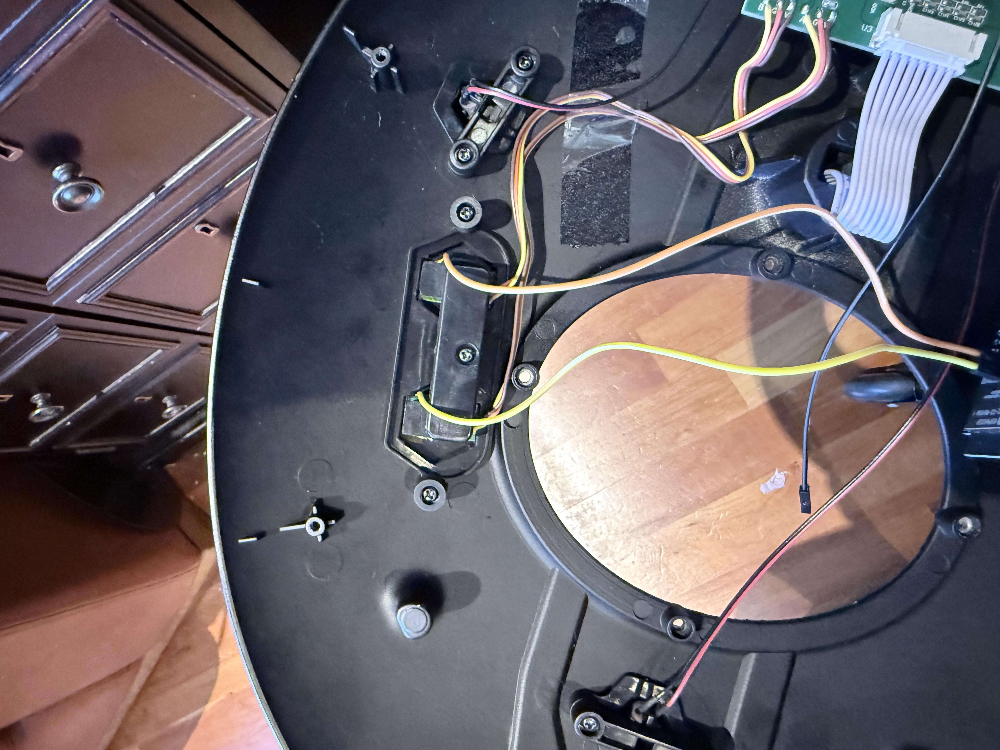

# 🖖 Tomy Refit USS Enterprise NCC-1701 HomeKit Controller

Control your **Tomy Star Trek Enterprise Refit** model with Apple HomeKit, a browser-based Web UI, and optionally Home Assistant — all running on a single ESP32-S3 board hidden inside the base.


---

## Features

- **Apple HomeKit** — 6 controls appear in the Home app; trigger via Siri, automations, or widgets
- **Web Interface** — browser-based control panel at `http://<IP>:8080`, works on any device on your network
- **Home Assistant** — optional MQTT integration with full auto-discovery (no manual HA configuration needed)
- **No cloud** — everything runs locally on your home network
- **Non-destructive** — no permanent modification to the Enterprise; original touch buttons still work

---

## Bill of Materials

| # | Item | Notes |
|---|------|-------|
| 1 | Tomy Star Trek USS Enterprise Refit | [Tomy product page](https://tomyplus.tomy.com/startrek2024) |
| 1 | ESP32-S3 Dev Board | [Example on Amazon CA](https://www.amazon.ca/dp/B0DB1WK3CW) — dual USB-C, 16MB flash |
| 2 | PN2222 NPN transistor | Or any NPN: 2N3904, BC547, S8050 |
| 2 | 220Ω resistor | Standard ¼W |
| 1 | Breadboard or perfboard | Breadboard for prototyping; solder to perfboard for permanent install |
| 1 | USB-C to USB-C cable (short, thin) | Powers the ESP32 from the same supply as the Enterprise — choose a thin/flat cable so it fits inside the base without blocking the Enterprise's own USB-C port |
| — | Jumper wires with header connectors | For connecting transistors to ESP32 GPIO pins |
| — | Fine wire (30 AWG recommended) | For connection to touch electrode plates |
| — | Kapton tape | For securing electrode wires without adding bulk |
| — | Heat shrink tubing | To insulate soldered joints |
| 1 | 3D printed oval base cover (STL in repo) | Replaces the original plastic oval cover; allows WiFi signal out and provides ESP32 mounting point |

**Optional:**
- Small zip ties or cable clips for tidy wire routing inside the base
- Double-sided foam tape to mount breadboard/perfboard inside base

---

## How It Works

The Tomy Enterprise has two capacitive touch buttons on its base (A = Mode Select, B = Fire Control). Each button has a small sub-board containing a touch IC. The **electrode plate on the back** of each sub-board is the raw capacitive sensing element.

The ESP32 drives a transistor briefly to pull each electrode to ground, mimicking the capacitance change of a finger press. The touch IC detects this as a button press.

> ⚠️ **Critical:** Connect to the **electrode plate on the back of the sub-board** — not to the S/G/V signal pads on the front. The signal pads are outputs from the touch IC and cannot be driven externally. This was the key hardware discovery for this project.


---

## Software Setup

### 1. Install Arduino IDE

Download and install [Arduino IDE](https://www.arduino.cc/en/software) (version 2.x recommended).

### 2. Add ESP32 Board Support

1. Open Arduino IDE → **Preferences**
2. Add this URL to "Additional boards manager URLs":
   ```
   https://raw.githubusercontent.com/espressif/arduino-esp32/gh-pages/package_esp32_index.json
   ```
3. Go to **Tools → Board → Boards Manager**
4. Search `esp32` and install **"esp32 by Espressif Systems"** (version 3.x)

### 3. Install Libraries

In Arduino IDE, go to **Tools → Manage Libraries** and install:

| Library | Author | Notes |
|---------|--------|-------|
| **HomeSpan** | HomeSpan | Search "HomeSpan" — version 2.x |
| **PubSubClient** | Nick O'Leary | Required even if not using MQTT |

### 4. Configure the Sketch

Open `enterprise_homekit.ino` and edit the MQTT section at the top if you want Home Assistant support:

```cpp
#define MQTT_BROKER  ""       // Set to your broker IP, e.g. "192.168.1.10"
                              // Leave as "" to disable — HomeKit and Web UI still work
#define MQTT_PORT    1883
#define MQTT_USER    ""       // Broker username (if required)
#define MQTT_PASS    ""       // Broker password (if required)
```

### 5. Board Settings

In Arduino IDE, configure:

| Setting | Value |
|---------|-------|
| Board | `ESP32S3 Dev Module` |
| USB CDC on Boot | `Disabled` |
| Partition Scheme | `Huge App (3MB No OTA/1MB SPIFFS)` |
| Upload Speed | `921600` |
| Port | Your ESP32's port (e.g. `/dev/cu.usbmodem...` on Mac, `COM3` on Windows) |

> **USB CDC on Boot — Disabled** means the left USB-C port on the ESP32 acts as a pure power port during normal use, which prevents interference with HomeKit and the Web UI. When you want to update firmware, simply swap the left port cable to your Mac and upload from Arduino IDE as normal — flashing still works without this setting enabled. Once uploaded, swap back to your power supply.

### 6. Upload the Sketch

1. Connect ESP32 to your computer via USB-C
2. Click **Upload** (→ arrow) in Arduino IDE
3. Wait for "Done uploading"

### 7. Configure WiFi

1. Open **Tools → Serial Monitor** and set baud rate to **115200**
2. Type the following and press Enter:
   ```
   W 
   - select your YourWiFiName then hit Enter
   - enter YourWiFiPassword
   ```
3. The ESP32 saves credentials and reboots automatically
4. After connecting, Serial Monitor shows your IP address and pairing code:
   ```
   ╔════════════════════════════════════════════════╗
   ║           ★  ENTERPRISE ONLINE  ★              ║
   ╠════════════════════════════════════════════════╣
   ║  Web UI   →  http://192.168.1.x:8080           ║
   ║  HomeKit  →  836-17-294                         ║
   ╚════════════════════════════════════════════════╝
   ```
5. **Note your IP address** — you will need it for the Web UI and to verify your setup later

---

## Hardware Assembly

> Complete the software setup above first so you know your ESP32 is working and have noted the IP address before you assemble it into the base.

### Overview



### Step 1 — Open the Base

1. Flip the Enterprise base upside down
2. Remove the screws holding the main circuit board to the base
3. There is a plastic shroud surrounding the board's USB-C port — remove this and set it aside

### Step 2 — Route the ESP32 Power Cable

Thread a thin USB-C cable from **outside** the base housing to the **inside**, near the Enterprise's USB-C power port. This cable will power the ESP32 independently without tapping into the Enterprise's circuitry.

When you’re ready to mount the ESP 32 board, connect the cable to the **left USB-C port** on the ESP32 (when the board is oriented with the USB ports facing downward). This is the native USB port — with `USB CDC on Boot: Disabled`, it acts as a pure power port during normal use, but also allows you to reflash the ESP32 by simply swapping the cable to your PC or Mac without disassembling the model.

> Choose a thin or flat USB-C cable. It must fit alongside the Enterprise's own power cable without blocking the Enterprise's port.


### Step 3 — Prepare the Touch Button Electrode Wires

The two touch button sub-boards are held down by a bracket. Each has a large electrode plate on its back face (the side facing inward toward the housing).


1. Unscrew the bracket holding down the capacitive button boards
2. For each sub-board:
   - Strip ~1.5 cm of a fine jumper wire to expose bare wire
   - Lay the bare wire flat against the **bottom edge** of the copper electrode plate (back of the sub-board)
   - Secure with Kapton tape — use the thinnest tape possible and avoid covering the face of the electrode, as excess thickness will prevent the button from seating properly in its housing
   - 

> The wire connected to the electrode plate will trigger the button if you touch it directly — this is expected behaviour since it is electrically part of the electrode.

### Step 4 — Reinstall Button Sub-boards

Carefully place each sub-board back into its slot in the button housing, routing the electrode wires out to the side. Secure the mounting bracket back into place.


### Step 5 — Wire the Transistors

For each button (repeat twice — once for Button A, once for Button B):

```
Electrode wire  →  Collector pin (right leg, flat face toward you)
220Ω resistor   →  Base pin (middle leg)
GPIO wire       →  Other end of 220Ω resistor
GND wire        →  Emitter pin (left leg)
```

**PN2222 pinout** (flat face toward you, pins pointing down):
```
LEFT = Emitter    MIDDLE = Base    RIGHT = Collector
```

1. Solder the electrode wire to the **Collector** pin of the transistor
2. Solder a 220Ω resistor to the **Base** (middle) pin
3. Solder a jumper wire to the other end of the resistor — this will connect to the ESP32 GPIO pin
4. Cover the soldered resistor and wire with heat shrink
5. Solder a wire to the **Emitter** pin — this will connect to GND

### Step 6 — Ground Connection

1. Connect the Emitter wire from **both** transistors together to a single ground wire (one GND is sufficient — all grounds on the Enterprise board share a common ground plane)
2. Strip ~1.5–2 cm of the ground wire end
3. Connect to the **GND** pin on the ESP32 via a jumper header connector

### Step 7 — Connect GPIO Pins

| ESP32 Pin | Connects to |
|-----------|-------------|
| GPIO 4 | 220Ω → Transistor Base → Collector to **Electrode A** (Mode Select button) |
| GPIO 5 | 220Ω → Transistor Base → Collector to **Electrode B** (Fire Control button) |
| GND | Both transistor Emitters (shared) |

Connect the GPIO jumper cables from the transistor base resistors to the appropriate header pins on the ESP32.

### Step 8 — Mount the ESP32

1. Connect the USB-C power cable you routed in Step 2 to the ESP32
2. Print the STL file from this repo to make a new oval base cover — this replaces the original plastic cover, allows WiFi signals to pass through, and provides a mounting point for the ESP32
3. Snap or slide the ESP32 board onto the 3D printed oval cover

### Step 9 — Final Assembly and Test

1. Power on the ESP32 via the USB-C cable
2. Mount the Enterprise onto the base
3. Plug the Enterprise's own USB-C power cable in
4. Test the physical touch buttons — they should still work normally
5. Test the Web UI at `http://<your-ESP32-IP>:8080`
6. Pair with HomeKit using code **836-17-294**

---

## Pairing with Apple HomeKit

1. Open the **Home** app on iPhone or iPad
2. Tap **+** → **Add Accessory**
3. Tap **More options** at the bottom
4. Select **Enterprise-Bridge** from the list
5. Enter the pairing code: **`836-17-294`**
6. Accept all 6 accessories when prompted and assign them to a room

> If pairing fails, ensure the ESP32 is on the same WiFi network as your iPhone and that no other HomeKit bridge with the same name is already paired.

---

## Using the Web Interface

Open a browser on any device on your network and go to:
```
http://<ESP32_IP>:8080
```

The IP address is shown in Serial Monitor after WiFi connects. You can also find it in your router's device list — it appears as `HomeSpan-...` or `Espressif`.

---

## Controls Reference

All controls are available in HomeKit, the Web UI, and Home Assistant.

| Control | What it does |
|---------|-------------|
| **Power ON to Warp** | Taps A once → waits 17 s for startup animation → taps A 3× more (2 s apart) → Warp Speed Mode |
| **Power OFF Enterprise** | Holds A for 5 seconds → power-down sequence |
| **Enterprise Mode (A)** | Single tap of Button A — cycles to the next lighting mode |
| **Enterprise Weapons (B)** | Single tap of Button B — alternates phaser banks |
| **Fire 2 Torpedoes** | Double tap B (0.5 s apart) — fires two photon torpedoes |
| **Fire Everything** | Triple tap B (0.5 s apart) — Battle Mode, full phaser and torpedo salvo |

### Lighting Modes (Button A cycles through)

| Mode | Description |
|------|-------------|
| Start-Up | Boot animation with running lights |
| Underway | Standard navigation lighting |
| Impulse Power | Impulse engine illumination |
| Full Power | All systems lit |
| Warp Speed | Warp nacelles glow + warp effect |

> **Note:** The ESP32 cannot detect whether the Enterprise is on or off. If the power sequence gets out of sync, use **Power OFF** to reset, wait a few seconds, then **Power ON to Warp** again.

---

## Home Assistant Setup (Optional)

1. Install the **Mosquitto broker** add-on in Home Assistant (Settings → Add-ons)
2. Create an MQTT user in Mosquitto settings
3. Set `MQTT_BROKER`, `MQTT_USER`, and `MQTT_PASS` in the sketch, then re-upload
4. In Home Assistant → **Settings → Devices & Services → MQTT** — the Enterprise device and all 6 entities appear automatically

---

## Troubleshooting

**Web UI not loading:**
- Use the ESP32's IP address (shown in Serial Monitor after WiFi connects) — not your phone's IP
- Port is **8080**, not 80
- Confirm your phone/computer is on the same WiFi as the ESP32

**HomeKit shows "Not Responding":**
- Check Serial Monitor shows the device is connected to WiFi
- Toggle WiFi off/on on your iPhone
- Ensure mDNS (port 5353 UDP) is not blocked on your network

**Pairing fails with "Unrecognized Controller":**
- Remove Enterprise-Bridge from the Home app completely (long press → Remove Accessory)
- Erase ESP32 flash, re-upload, re-enter WiFi, then re-pair

**Buttons not registering on Enterprise:**
- Ensure wires make firm contact with the copper electrode plate on the back of each sub-board
- The Enterprise must be powered via USB-C before button presses will work
- Power cycle the Enterprise after the ESP32 has fully booted if buttons seem unresponsive

**Power sequence unreliable:**
- The 17-second startup wait may need adjusting — change `STARTUP_WAIT_MS` in the sketch
- Physical touch buttons on the Enterprise itself always work regardless of ESP32 state

---

## Erasing the ESP32 Flash

To fully reset the ESP32 (clears WiFi credentials and HomeKit pairing):

**Mac:**
```bash
~/Library/Arduino15/packages/esp32/tools/esptool_py/5.2.0/esptool --port /dev/cu.usbmodem1101 erase-flash
```

**Windows:**
```cmd
esptool --port COM3 erase-flash
```

Replace the port with your actual port. After erasing, re-upload the sketch and reconfigure WiFi.

---

## Project Background

This project required systematic hardware debugging to work out:

- The S/G/V pads on the sub-board are **digital outputs** from the touch IC — they cannot be driven externally
- The raw electrode is the **large copper plate on the back** of the sub-board PCB — this is the correct connection point
- Permanently connecting a wire to the electrode causes the touch IC to **auto-calibrate** and become insensitive — the transistor switch approach (open circuit at idle, briefly closes on press) solves this
- The ESP32 GPIO pins must be set LOW **before** the Enterprise boots, otherwise the touch IC recalibrates around the connected circuit

---

## License

MIT License — free to use, modify, and share. If you build this, share your build! 🖖

---

*Made with ☕ and a lot of multimeter readings. Live long and prosper.*
