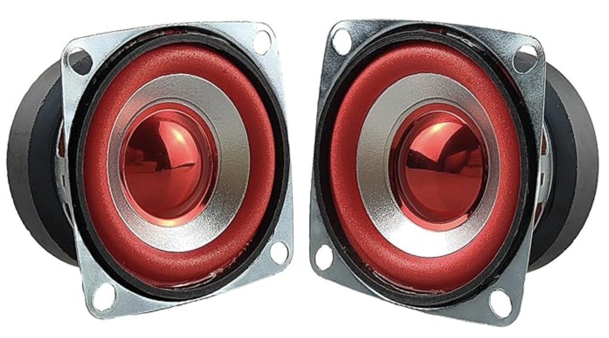
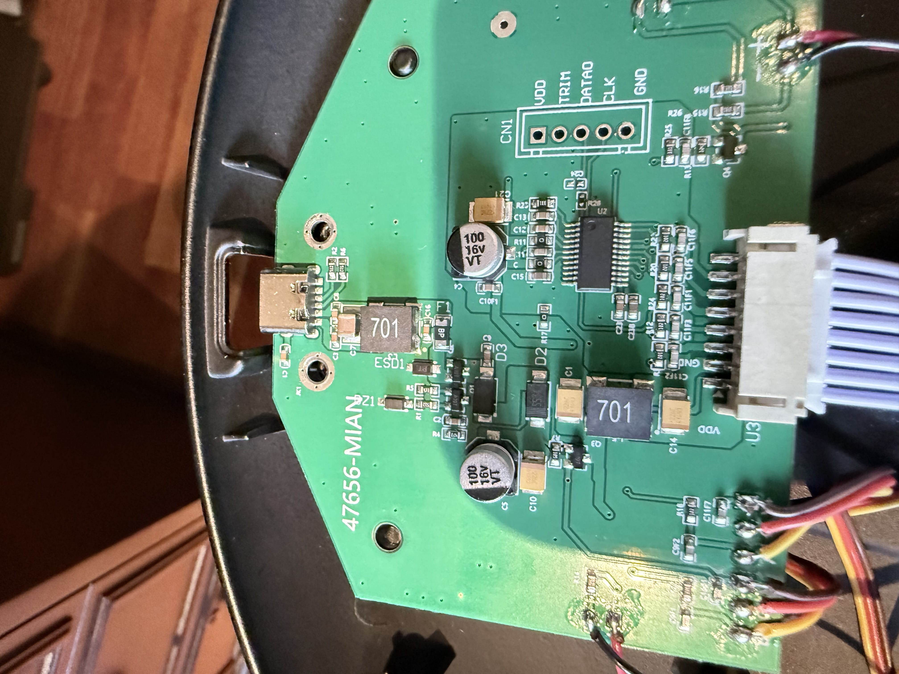
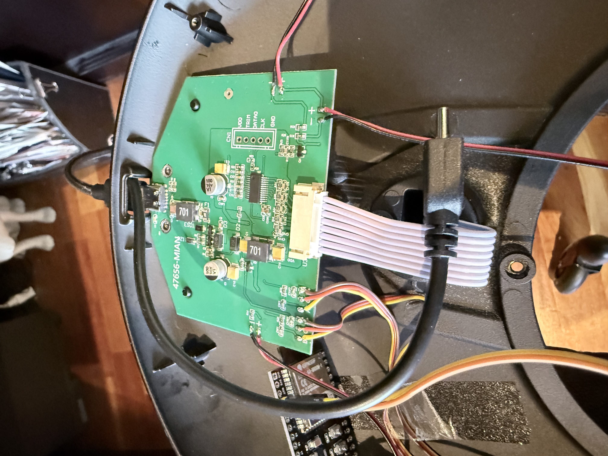
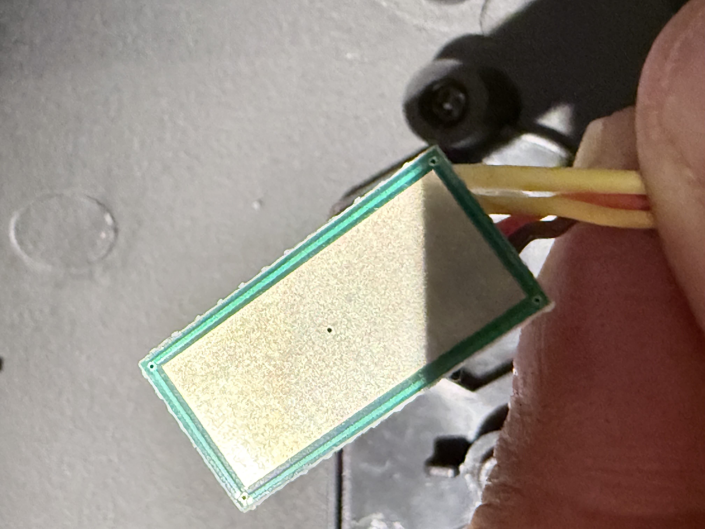
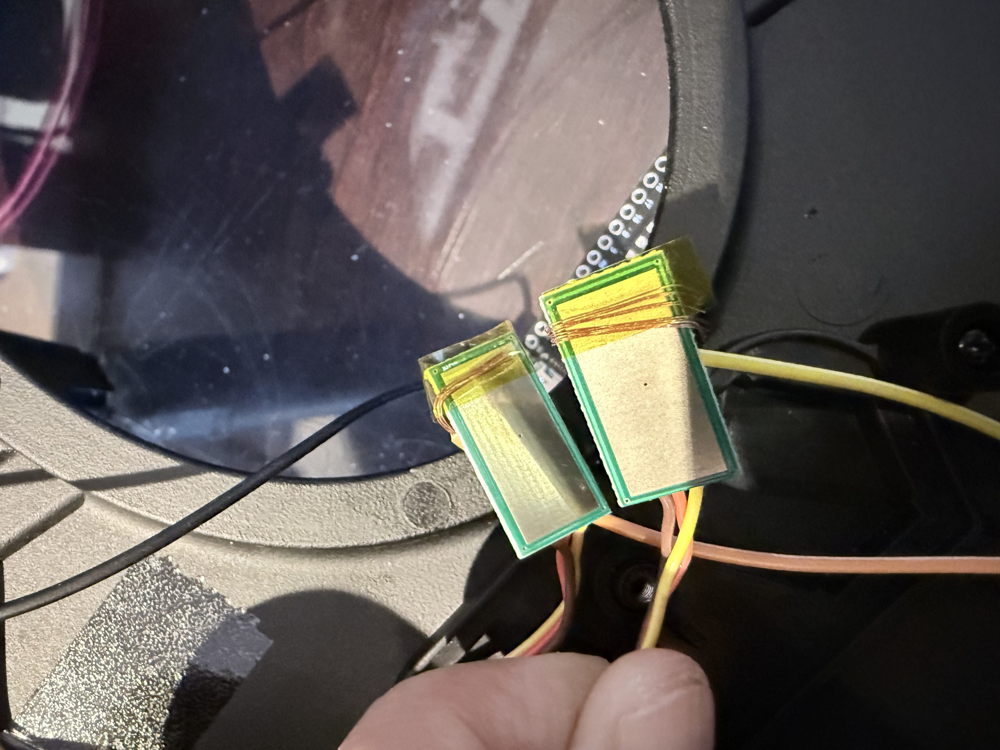
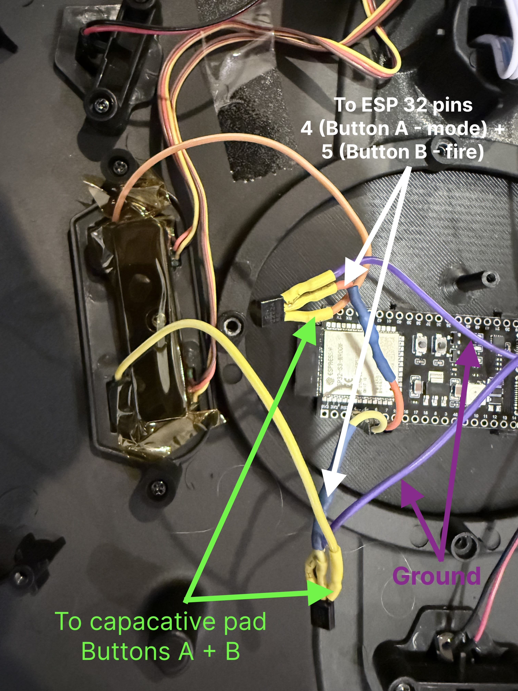
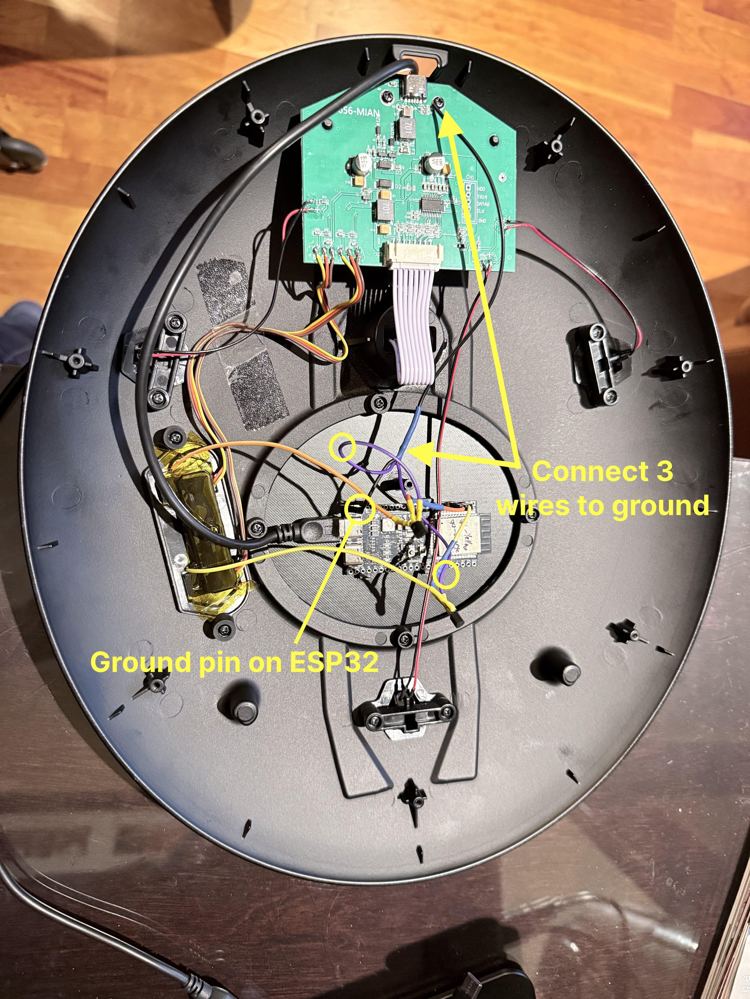
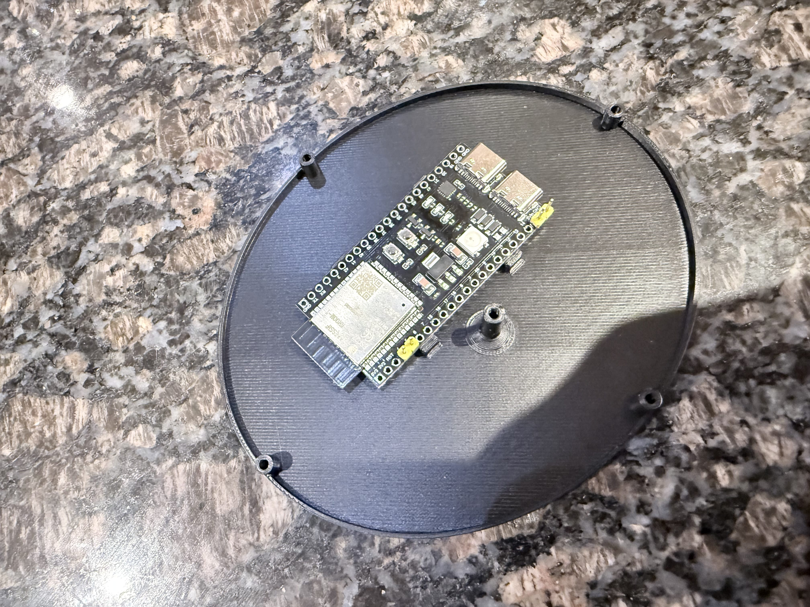
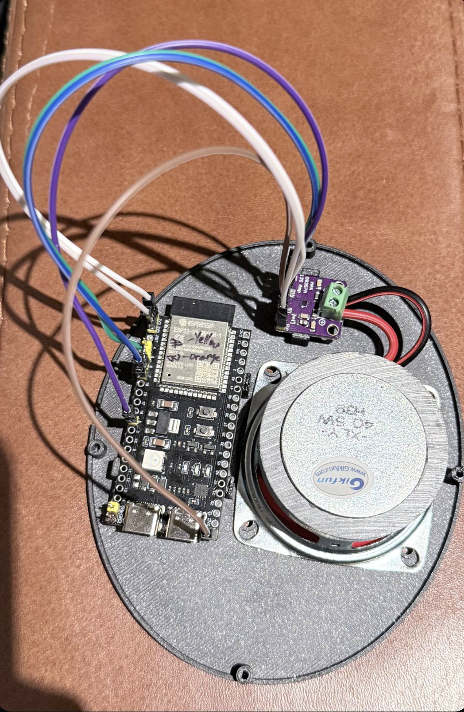
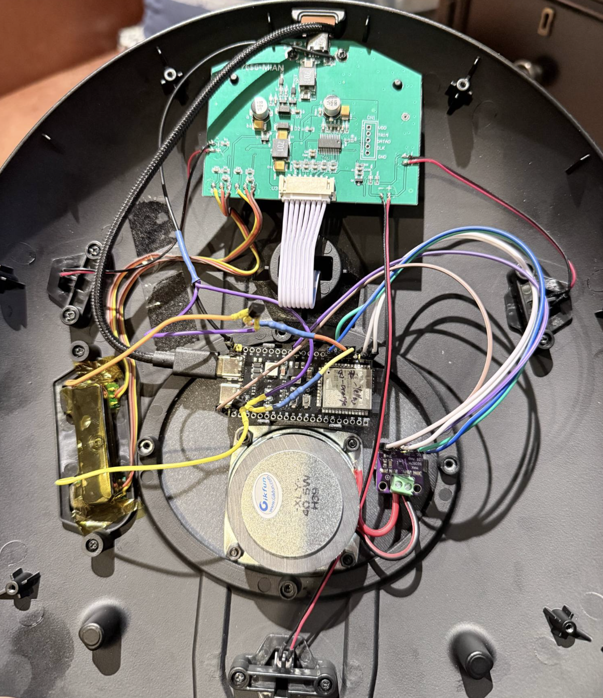

# 🖖 Tomy Refit USS Enterprise NCC-1701 HomeKit Controller

Control your **Tomy Star Trek Enterprise Refit** model with Apple HomeKit, a browser-based Web UI, and optionally Home Assistant — all running on a single ESP32-S3 board hidden inside the base.


See it in action here: https://youtu.be/2ChCu2VM8fc?si=r5U2L9rrQbftr_Qt
---

## Features

- **Apple HomeKit** — 6 controls appear in the Home app; trigger via Siri, automations, or widgets
- **Web Interface** — browser-based control panel at `http://<IP>:8080`, works on any device on your network. Synchronized phaser, torpedo, and Star Trek anthem sounds play through your browser when controlled from a web browser on your local network
- **Home Assistant** — optional MQTT integration with full auto-discovery (no manual HA configuration needed)
- **No cloud** — everything runs locally on your home network
- **Non-destructive** — no permanent modification to the Enterprise; original touch buttons still work
- **Optional built-in speaker** — add a MAX98357A I2S amplifier and a small speaker inside the base so sounds play through the model itself, triggered by HomeKit, Home Assistant, or the Web UI

---

## Bill of Materials

| # | Item | Notes |
|---|------|-------|
| 1 | Tomy Star Trek USS Enterprise Refit | [Tomy product page](https://tomyplus.tomy.com/startrek2024) |
| 1 | ESP32-S3 Dev Board | [Example on Amazon CA](https://www.amazon.ca/dp/B0DB1WK3CW) — dual USB-C, 16MB flash - I used one without header pins to keep it neat. The 3d printed cover plate works best with no header pins as the mounting bracket needs an edge to grip on to |
| 2 | PN2222 NPN transistor | Or any NPN: 2N3904, BC547, S8050 |
| 2 | 220Ω resistor | Standard ¼W |
| 1 | USB-C to USB-C/USB A cable (thinner is better) | Powers the ESP32 - needs its own power supply — choose a thin/flat cable so it fits inside the base without blocking the Enterprise's own USB-C port |
| 1 | USB-C or USB power supply | A separate power supply for the ESP 32, needed since we aren't touching the model's own power system for safety and ease of installation |
| — | Jumper wires with header connectors | For connecting transistors to ESP32 GPIO pins |
| — | Fine wire (30 AWG recommended) | For connection to touch electrode plates |
| — | Kapton tape | For securing electrode wires without adding bulk |
| — | Heat shrink tubing | To insulate soldered joints |
| 1 | 3D printed oval base cover (STL in repo) | Replaces the original metal oval cover; allows WiFi signal out and provides ESP32 mounting point |

**Optional:**
- Small zip ties or cable clips for tidy wire routing inside the base

**Optional — Speaker Add-on:**

| # | Item | Notes |
|---|------|-------|
| 1 | MAX98357A I2S Class D Audio Amplifier Module | "MAX98357 I2S Class D Audio Amplifier Module Breakout Interface DAC Decoder Board for Arduino with Dupont Cable 2Pcs" — comes with Dupont cables |
| 1 | [2" 4Ω 5W Speaker](https://www.amazon.ca/dp/B081169PC5?ref=ppx_yo2ov_dt_b_fed_asin_title) | This speaker is larger than others, but still fits in the base and sounds less tinny with deeper bass than thinner, cheaper speakers |
| 4 | M3 screws and nuts | To mount the speaker to the 3D printed cover plate |
| — | Jumper wires (male-to-male Dupont) | Included with the amp board |




---

## How It Works

The Tomy Enterprise has two capacitive touch buttons on its base (A = Mode Select, B = Fire Control). Each button has a small sub-board containing a touch IC. The **electrode plate on the back** of each sub-board is the raw capacitive sensing element.

The ESP32 drives a transistor briefly to pull each electrode to ground, mimicking the capacitance change of a finger press. The touch IC detects this as a button press.

> ⚠️ **Critical:** Connect to the **electrode plate on the back of the sub-board** — not to the S/G/V signal pads on the front. The signal pads are outputs from the touch IC and cannot be driven externally. This was the key hardware discovery for this project.


---

## Software Setup

### 1. Install Arduino IDE

Download and install [Arduino IDE](https://www.arduino.cc/en/software) (version 2.x recommended).

### 2. Add ESP32 Board Support

1. Open Arduino IDE → **Preferences**
2. Add this URL to "Additional boards manager URLs":
   ```
   https://raw.githubusercontent.com/espressif/arduino-esp32/gh-pages/package_esp32_index.json
   ```
3. Go to **Tools → Board → Boards Manager**
4. Search `esp32` and install **"esp32 by Espressif Systems"** (version 3.x)

### 3. Install Libraries

In Arduino IDE, go to **Tools → Manage Libraries** and install:

| Library | Author | Notes |
|---------|--------|-------|
| **HomeSpan** | HomeSpan | Search "HomeSpan" — version 2.x |
| **PubSubClient** | Nick O'Leary | Required even if not using MQTT |
| **ESP8266Audio** | Earle Philhower | Required only for the speaker build — search "ESP8266Audio" |

### 4. Download and Open the Sketch

There are two sketch variants — choose the one that matches your build:

| Sketch folder | Use when |
|---------------|----------|
| `enterprise_homekit/` | Standard build — sounds play in your browser only |
| `enterprise_homekit_speaker/` | Speaker build — sounds play through the MAX98357A amp and speaker inside the base |

Each folder contains the same four files:

| File | Purpose |
|------|---------|
| `enterprise_homekit.ino` / `enterprise_homekit_speaker.ino` | Main sketch |
| `anthem_mp3.h` | Star Trek anthem played during the power-on sequence |
| `phaser_mp3.h` | Phaser fire sound |
| `torpedo_mp3.h` | Photon torpedo launch sound |

The three `*_mp3.h` files contain the MP3 audio embedded as byte arrays. In the standard sketch the ESP32 serves them to your browser. In the speaker sketch the ESP32 decodes and plays them through the I2S amplifier, and can also serve them to the browser depending on the audio mode selected in the Web UI.

**To get the sketch into Arduino IDE:**

1. Download this repository:
   - **Easiest:** click the green **Code → Download ZIP** button on GitHub, then unzip it
   - Or `git clone https://github.com/SteveW25561/Tomy-Enterprise-Refit-Homekit-ESP32.git`
2. Arduino IDE requires the `.ino` file to live inside a folder of the **same name** — both `enterprise_homekit/` and `enterprise_homekit_speaker/` are already set up that way. Make sure all four files stay together in whichever folder you use.
3. In Arduino IDE choose **File → Open…** and select the `.ino` file from your chosen folder
4. Confirm the three `.h` sound files appear as tabs across the top of the editor window — if any tab is missing, the audio will not play. Close the sketch and check the folder contents before continuing.

Then edit the MQTT section near the top of the sketch if you want Home Assistant support:

```cpp
#define MQTT_BROKER  ""       // Set to your broker IP, e.g. "192.168.1.10"
                              // Leave as "" to disable — HomeKit and Web UI still work
#define MQTT_PORT    1883
#define MQTT_USER    ""       // Broker username (if required)
#define MQTT_PASS    ""       // Broker password (if required)
```

### 5. Board Settings

In Arduino IDE, configure:

| Setting | Value |
|---------|-------|
| Board | `ESP32S3 Dev Module` |
| USB CDC on Boot | `Disabled` |
| Partition Scheme | `Huge App (3MB No OTA/1MB SPIFFS)` |
| Upload Speed | `921600` |
| Port | Your ESP32's port (e.g. `/dev/cu.usbmodem...` on Mac, `COM3` on Windows) |

> **USB CDC on Boot — Disabled** means the left USB-C port on the ESP32 acts as a pure power port during normal use, which prevents interference with HomeKit and the Web UI. When you want to update firmware, simply unplug from the power adapter and plug into to your PC or Mac and upload from Arduino IDE as normal — flashing still works without this setting enabled. Once uploaded, plug back into your power supply. This allows you to reporgam the board without opening up the base again.

### 6. Upload the Sketch

1. Connect ESP32 to your computer via USB-C to the ESP32's left USB port (as seen with the ports facing downward)
2. Open the Arduino IDE app and Open the Enterprise_Homekit.ino sketch file 
3. Click **Upload** (→ arrow) in Arduino IDE
4. Wait for "Done uploading"

### 7. Configure WiFi

1. Open **Tools → Serial Monitor** and set baud rate to **115200**
2. Type the following and press Enter:
   ```
   W 
   - select your YourWiFiName then hit Enter
   - enter YourWiFiPassword
   ```
3. The ESP32 saves credentials and reboots automatically
4. After connecting, Serial Monitor shows your IP address and pairing code:
   ```
   ╔════════════════════════════════════════════════╗
   ║           ★  ENTERPRISE ONLINE  ★              ║
   ╠════════════════════════════════════════════════╣
   ║  Web UI   →  http://192.168.1.x:8080           ║
   ║  HomeKit  →  836-17-294                         ║
   ╚════════════════════════════════════════════════╝
   ```
5. **Note your IP address** — you will need it for the Web UI and to verify your setup later. The device registers on your network as **`Tomy-Refit-Enterprise`**, so you can also find its IP address in your router's DHCP client table by looking for that name if you ever need it again.

---

## Hardware Assembly

> Complete the software setup above first so you know your ESP32 is working and have noted the IP address before you assemble it into the base.


### Step 1 — Open the Base

1. Flip the Enterprise base upside down
2. Remove the screws holding the main circuit board to the base
3. There is a plastic shroud surrounding the board's USB-C port — remove this and set it aside
![]
4. Remove the oval metal cover - this will be replaced by the 3D printed cover to allow WiFi signals out. You can install it now or leave to a later phase to make it easier to work on the base.
### Step 2 — Route the ESP32 Power Cable

Thread a thin USB-C cable from **outside** the base housing to the **inside**, near the Enterprise's USB-C power port. This cable will power the ESP32 independently without tapping into the Enterprise's circuitry.
![]
When you’re ready to mount the ESP 32 board, connect the cable to the **left USB-C port** on the ESP32 (when the board is oriented with the USB ports facing downward). This is the native USB port — with `USB CDC on Boot: Disabled`, it acts as a pure power port during normal use, but also allows you to reflash the ESP32 by simply swapping the cable to your PC or Mac without disassembling the model.

> Choose a thin or flat USB-C cable. It must fit alongside the Enterprise's own power cable without blocking the Enterprise's port.


### Step 3 — Prepare the Touch Button Electrode Wires

The two touch button sub-boards are held down by a bracket. Each has a large electrode plate on its back face (the side facing inward toward the housing).

![]

1. Unscrew the bracket holding down the capacitive button boards
2. For each sub-board:
   - Strip ~1.5 cm of a fine jumper wire to expose bare wire
   - Lay the bare wire flat against the **bottom edge** of the copper electrode plate (back of the sub-board)
   - Secure with Kapton tape — use the thinnest tape possible and avoid covering the face of the electrode, as excess thickness will prevent the button from seating properly in its housing
   - ![]

> The wire connected to the electrode plate will trigger the button if you touch it directly — this is expected behaviour since it is electrically part of the electrode.

### Step 4 — Reinstall Button Sub-boards

Carefully place each sub-board back into its slot in the button housing, routing the electrode wires out to the side. Secure the mounting bracket back into place.
![]


### Step 5 — Wire the Transistors

For each button (repeat twice — once for Button A, once for Button B):

```
Electrode wire  →  Collector pin (right leg, flat face toward you)
220Ω resistor   →  Base pin (middle leg)
GPIO wire       →  Other end of 220Ω resistor
GND wire        →  Emitter pin (left leg)
```

**PN2222 pinout** (flat face toward you, pins pointing down):
```
LEFT = Emitter    MIDDLE = Base    RIGHT = Collector
```

1. Solder the touch button electrode wire to the **Collector** pin of the transistor
2. Solder a 220Ω resistor to the **Base** (middle) pin
3. Solder a jumper wire to the other end of the resistor — this will connect to the ESP32 GPIO pin
4. Cover the soldered resistor and wire with heat shrink
5. Solder a wire to the **Emitter** pin — this will connect to GND
![]
(*note in this image the ground and capactive button wires are soldered to the wrong transistor legs - it still works, but wire according to the siagram above for proper reliability)
### Step 6 — Ground Connection

1. Connect the Emitter wire from **both** transistors together to a single ground wire (one GND is sufficient — all grounds on the Enterprise board share a common ground plane)
2. Strip ~1.5–2 cm of the ground wire end
3. Connect to the **GND** pin on the ESP32 via a jumper header connector
![]
(*note in this image the ground and capactive button wires are soldered to the wrong transistor legs - it still works, but wire according to the siagram above for proper reliability)
### Step 7 — Connect GPIO Pins

| ESP32 Pin | Connects to                                                  |
|-----------|--------------------------------------------------------------|
| GPIO 4    | 220Ω → Transistor Base <br>Transistor Collector (middle leg) to **Electrode A** (Mode Select button) |
| GPIO 5    | 220Ω → Transistor Base <br>Transistor Collector (middle leg) to **Electrode B** (Fire Control button) |
| GND       | Both transistor Emitters (shared)                            |

Connect the GPIO jumper cables from the transistor base resistors to the appropriate header pins on the ESP32.

### Step 8 — Mount the ESP32
![]
1. Connect the USB-C power cable you routed in Step 2 to the ESP32
2. Print the appropriate STL from the **`Stand covers STL/`** folder:
   - **Standard build:** `Enterprise stand cover plate.stl`
   - **Speaker build:** `Enterprise stand cover plate - with speaker.stl` (has a grille cut-out for the 2" speaker)
3. Snap or slide the ESP32 board onto the 3D printed oval cover

### Step 9 — Final Assembly and Test

1. Power on the ESP32 via the USB-C cable
2. Mount the Enterprise onto the base
3. Plug the Enterprise's own USB-C power cable in
4. Test the physical touch buttons — they should still work normally
5. Test the Web UI at `http://<your-ESP32-IP>:8080`
6. Pair with HomeKit using code **836-17-294**

---

## Optional — Speaker Build

> Skip this section if you are not adding a speaker. The standard `enterprise_homekit/` sketch does not require any of the components or steps below.


### Speaker BOM

See the [Bill of Materials](#bill-of-materials) section above for the speaker-specific parts list.

### Speaker Wiring

Wire the MAX98357A amplifier board to the ESP32-S3 as follows:

| MAX98357A Pin | ESP32-S3 Pin | Wire colour suggestion |
|---------------|--------------|------------------------|
| BCLK | GPIO 6 | blue |
| LRC | GPIO 7 | green |
| DIN | GPIO 8 | yellow |
| Vin | 3V3 (first pin) | red |
| SD | 3V3 (second pin) | red |
| GND | GND | black |
| GAIN | — | **leave unconnected** |
| + (speaker terminal) | Speaker + | — |
| − (speaker terminal) | Speaker − | — |

**GAIN pin:** Leave completely floating — do not connect to anything, no wire and no resistor. The floating state is detected by the MAX98357A as 9 dB gain, which is the correct default. Software volume control in the sketch handles fine adjustment from there.

**Two 3V3 pins:** The ESP32-S3 board has two 3V3 pins both connected to the same internal rail — use one for Vin and the other for SD. No Y-cable needed.

### How the Audio Chain Works

The MAX98357A is an I2S digital audio amplifier. The ESP32-S3 sends compressed MP3 data (decoded on-chip using the **ESP8266Audio** library) as a digital I2S stream over three wires (BCLK, LRC, DIN). The MAX98357A converts the digital stream to an amplified analog output and drives the speaker directly — no separate DAC or analog amplifier is needed.

### Software Volume

The sketch controls volume via the `SetGain()` function in ESP8266Audio. Default is 25% (`speakerVol = 0.25f`, `I2S_MAX_GAIN = 0.5f`). The Web UI volume slider (0–100%) adjusts this in real time and saves to NVS across reboots. Start at 25% and increase to taste — the MAX98357A hardware gain is fixed at 9 dB, so software gain above 0.5× risks clipping.

### Audio Mode Toggle

The Web UI has a **Browser / Speaker** toggle. In **Browser** mode all sounds play on the device running the web interface (original behaviour). In **Speaker** mode all sounds — including those triggered by HomeKit or Home Assistant — play through the I2S amplifier and speaker inside the base.

### Step 10 — Install the Speaker Sketch

Use the sketch in **`enterprise_homekit_speaker/`** instead of `enterprise_homekit/`. Install the **ESP8266Audio** library first (see [Install Libraries](#3-install-libraries) above), then open `enterprise_homekit_speaker/enterprise_homekit_speaker.ino` in Arduino IDE and upload it the same way as the standard sketch.

### Step 11 — Print the Speaker Cover Plate

Print the STL file **`Stand covers STL/Enterprise stand cover plate - with speaker.stl`** instead of the plain cover plate. This version has a grille cut-out sized to fit the 2" speaker over the oval opening in the base.

### Step 12 — Mount the Speaker and Amplifier

1. Fit the 2" speaker into the recess in the 3D printed speaker cover plate, aligning it with the grille cut-out
2. Mount the MAX98357A board inside the base — the Dupont cables included with the board are long enough to reach the ESP32 GPIO and power pins
3. Connect the wiring per the table above
4. Route speaker wires from the amplifier board to the speaker terminals




---

## Pairing with Apple HomeKit

1. Open the **Home** app on iPhone or iPad
2. Tap **+** → **Add Accessory**
3. Tap **More options** at the bottom
4. Select **Enterprise-Bridge** from the list
5. Enter the pairing code: **`836-17-294`**
6. Accept all 6 accessories when prompted and assign them to a room

> If pairing fails, ensure the ESP32 is on the same WiFi network as your iPhone and that no other HomeKit bridge with the same name is already paired.

---

## Using the Web Interface

Open a browser on any device on your network and go to:
```
http://<ESP32_IP>:8080
```

The IP address is shown in Serial Monitor after WiFi connects. You can also find it in your router's device list — it appears as `HomeSpan-...` or `Espressif`.

### Timing Tweaker

Scroll to the bottom of the Web UI and you'll find a collapsible **Timing Tweaker** panel. This lets you fine-tune every delay used by the multi-tap sequences (single phaser, double-tap torpedoes, "Fire Everything" salvo, and the Anthem startup) without re-flashing the ESP32.


- All values are in **milliseconds, measured from the initial button tap**
- Edits apply immediately so you can iterate live against the model
- Press **Save** to persist the values to flash so they survive a reboot
- If you ever want to return to the defaults, just clear the values or re-flash the sketch

Use this if your particular Enterprise needs a slightly different cadence to keep the sounds locked to the on-model lighting effects.

---

## Controls Reference

All controls are available in HomeKit, the Web UI, and Home Assistant.

| Control | What it does |
|---------|-------------|
| **Power ON to Warp** | Taps A once → waits 17 s for startup animation → taps A 3× more (2 s apart) → Warp Speed Mode |
| **Power OFF Enterprise** | Holds A for 5 seconds → power-down sequence |
| **Enterprise Mode (A)** | Single tap of Button A — cycles to the next lighting mode |
| **Enterprise Weapons (B)** | Single tap of Button B — alternates phaser banks |
| **Fire 2 Torpedoes** | Double tap B (0.5 s apart) — fires two photon torpedoes |
| **Fire Everything** | Triple tap B (0.5 s apart) — Battle Mode, full phaser and torpedo salvo |

### Lighting Modes (Button A cycles through)

| Mode | Description |
|------|-------------|
| Start-Up | Boot animation with running lights |
| Underway | Standard navigation lighting |
| Impulse Power | Impulse engine illumination |
| Full Power | All systems lit |
| Warp Speed | Warp nacelles glow + warp effect |

> **Note:** The ESP32 cannot detect whether the Enterprise is on or off. If the power sequence gets out of sync, use **Power OFF** to reset, wait a few seconds, then **Power ON to Warp** again.

---

## Home Assistant Setup (Optional)

1. Install the **Mosquitto broker** add-on in Home Assistant (Settings → Add-ons)
2. Create an MQTT user in Mosquitto settings
3. Set `MQTT_BROKER`, `MQTT_USER`, and `MQTT_PASS` in the sketch, then re-upload
4. In Home Assistant → **Settings → Devices & Services → MQTT** — the Enterprise device and all 6 entities appear automatically

---

## Troubleshooting

**Web UI not loading:**
- Use the ESP32's IP address (shown in Serial Monitor after WiFi connects) — not your phone's IP
- Port is **8080**, not 80
- Confirm your phone/computer is on the same WiFi as the ESP32

**HomeKit shows "Not Responding":**
- Check Serial Monitor shows the device is connected to WiFi
- Toggle WiFi off/on on your iPhone
- Ensure mDNS (port 5353 UDP) is not blocked on your network

**Pairing fails with "Unrecognized Controller":**
- Remove Enterprise-Bridge from the Home app completely (long press → Remove Accessory)
- Erase ESP32 flash, re-upload, re-enter WiFi, then re-pair

**Buttons not registering on Enterprise:**
- Ensure wires make firm contact with the copper electrode plate on the back of each sub-board
- The Enterprise must be powered via USB-C before button presses will work
- Power cycle the Enterprise after the ESP32 has fully booted if buttons seem unresponsive

**Power sequence unreliable:**
- The 17-second startup wait may need adjusting — change `STARTUP_WAIT_MS` in the sketch
- Physical touch buttons on the Enterprise itself always work regardless of ESP32 state

**Speaker not producing sound:**
- Confirm you uploaded `enterprise_homekit_speaker.ino`, not the standard sketch
- Check the Web UI audio toggle is set to **Speaker** (not Browser)
- Verify BCLK → GPIO 6, LRC → GPIO 7, DIN → GPIO 8, Vin and SD both connected to 3V3, GND connected
- Confirm the GAIN pin is left completely unconnected — any connection here will change the gain or disable output
- Try increasing volume in the Web UI slider above the 25% default
- Check the speaker terminal wires are firmly inserted into the MAX98357A screw or spring terminals

---

## Erasing the ESP32 Flash

To fully reset the ESP32 (clears WiFi credentials and HomeKit pairing):

**Mac:**
```bash
~/Library/Arduino15/packages/esp32/tools/esptool_py/5.2.0/esptool --port /dev/cu.usbmodem1101 erase-flash
```

**Windows:**
```cmd
esptool --port COM3 erase-flash
```

Replace the port with your actual port. After erasing, re-upload the sketch and reconfigure WiFi.

---

## Project Background

This project required systematic hardware debugging to work out:

- The S/G/V pads on the sub-board are **digital outputs** from the touch IC — they cannot be driven externally
- The raw electrode is the **large copper plate on the back** of the sub-board PCB — this is the correct connection point
- Permanently connecting a wire to the electrode causes the touch IC to **auto-calibrate** and become insensitive — the transistor switch approach (open circuit at idle, briefly closes on press) solves this
- The ESP32 GPIO pins must be set LOW **before** the Enterprise boots, otherwise the touch IC recalibrates around the connected circuit

---

## License

MIT License — free to use, modify, and share. If you build this, share your build! 🖖

---

*Made with ☕ and a lot of multimeter readings. Live long and prosper.*
